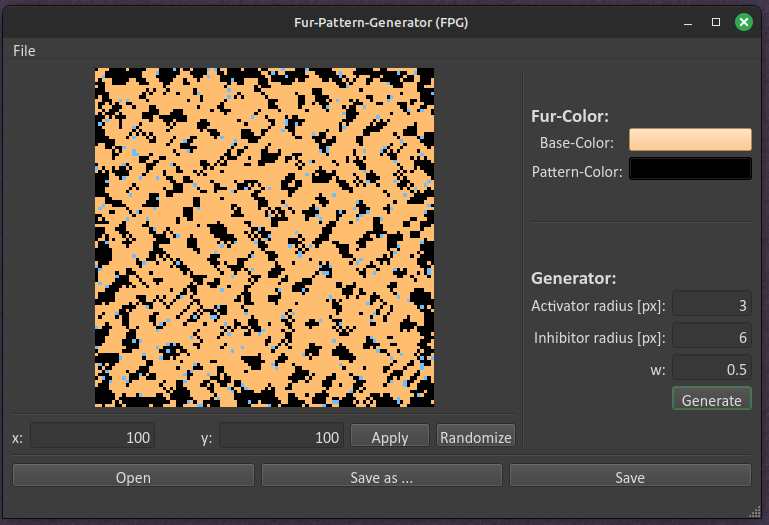

# fur pattern generator


[](https://opensource.org/licenses/MIT)
[](https://github.com/RobertHue/fur_pattern_generator/actions/workflows/ci-test.yml)

With this Blender add-on, you can generate textures in the form of stripes and spots found on animals, such as leopards and tigers.

It can be used in one of the following three ways:

- Used in a QT application (`fpg-gui/`):


- Used as Blender Addon (`fpg-bpy-addon/`):


- by using it as a library for your own application (`fpg/`)

---

The algorithm used for this purpose is the one defined by David Young. It is based on cellular automata and simulates the behavior of pigment cells (melanocytes) inside mammals. These cells send out activator and inhibitor genes to their neighboring cells, resulting in the observed patterns.

- https://users.math.yale.edu/public_html/People/frame/Fractals/Panorama/Biology/Leopard/Leopard.html
- http://ccl.northwestern.edu/netlogo/models/Fur

## Table of Contents

- [fur pattern generator](#fur-pattern-generator)
  - [Table of Contents](#table-of-contents)
  - [Repository structure](#repository-structure)
  - [Getting Started](#getting-started)
    - [Installation prerequisites](#installation-prerequisites)
  - [Usage](#usage)
  - [Development](#development)
    - [Visual Studio Code](#visual-studio-code)
    - [Blender \& VSCode interoperability](#blender--vscode-interoperability)
    - [Blender Python Conventions](#blender-python-conventions)
    - [Hints](#hints)

## Repository structure

The repository is structured as follows:

- `.github/`: contains the automated testing & linting by using [GitHub Actions]
- `.vscode/`: workspace configuration for [VSCode]
- `fpg/`: Python package containing the modules of the fur-pattern-generator (FPG)
- `fpg-bpy-addon/`: Python package containing the blender addon
- `fpg-gui/`: Python package containing the QT-based GUI
- `tests/`: contains unit tests for this project
- `pyproject.toml`: configuration file for [Poetry], [isort], [Black], [mypy], [Ruff] and [pyright]
- `README.md`: the README file that you are reading right now

## Getting Started

### Installation prerequisites

- [Git]
- [VSCode]
- [Python] (see `pyproject.toml` for it's version)
- Install [Poetry], as follows:

   ```console
   python -m pip install --upgrade pip
   python -m pip install --user pipx
   python -m pipx ensurepath
   pipx install poetry
   ```

To install these dependencies, just execute the following command:

   ```console
   poetry install
   ```

## Usage

Go into UV-Editor and create an image by hitting `New Image`.
It is recommended to choose low resolution, because the algorithm is not yet optimized enough.

After that you can generate a `Random Noise` or let the CA young pattern generator run by hitting `CA Young`:


---

## Development

This section serves rather as a knowledge-base for developers,
who want to test or extend this addon.

### Visual Studio Code

I recommend utilizing Visual Studio Code due to its convenient development features, including autocomplete, syntax highlighting, seamless integration with version control systems, and other tools that significantly enhance the speed and ease of the development process. Just install the recommended VSCode extensions of this project and you are good to go.

### Blender & VSCode interoperability

- https://wiki.blender.org/wiki/Reference/Release_Notes/2.80/Python_API/Addons
- https://docs.blender.org/api/2.83/bpy.props.html
- https://b3d.interplanety.org/en/using-microsoft-visual-studio-code-as-external-ide-for-writing-blender-scripts-add-ons/
- https://youtu.be/q06-hER7Y1Q

### Blender Python Conventions

- https://www.gdquest.com/docs/guidelines/best-practices/blender-python/
- https://realpython.com/absolute-vs-relative-python-imports/
- https://b3d.interplanety.org/en/class-naming-conventions-in-blender-2-8-python-api/

### Hints

- Please install the recommended plugins for VSCode (located in `.vscode/settings.json`).

- For testing changes in your addon really quick, just reload the addon with F1:

   ```console
   Blender: Reload Addons`
   ```

- For debugging your addon, you can also use normal or conditional break-points.


[Git]: https://git-scm.com/downloads
[Python]: https://www.python.org/
[GitHub Actions]: https://github.com/features/actions
[VSCode]: https://code.visualstudio.com/
[Poetry]: https://python-poetry.org/
[isort]: https://pycqa.github.io/isort/
[Black]: https://github.com/psf/black
[mypy]: https://mypy.readthedocs.io/en/stable/
[Ruff]: https://github.com/astral-sh/ruff
[pyright]: https://github.com/microsoft/pyright
