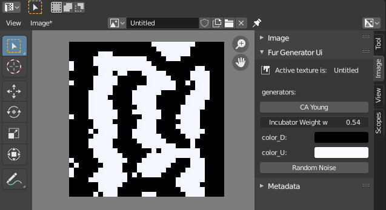

# fur_pattern_generator
With this blender add-on you can generate textures in the shape of the stripes
and dots on animals, such as leopards and tigers.

The algorithm used for it is the one defined by David Young. It is based on
cellular automata and is simulating the pigment-cells (melanocytes) inside of
mammals, that are sending out activator and inhibator genes into their
neighborhood:
- https://users.math.yale.edu/public_html/People/frame/Fractals/Panorama/Biology/Leopard/Leopard.html
- http://ccl.northwestern.edu/netlogo/models/Fur

# Table of Contents
1. [Usage](#usage)
2. [Development](#development)

	* [Good to know](#good-to-know)
	* [Coding Conventions](#coding-conventions)
	* [Visual Studio Code](#visual-studio-code)

3. [Installation](#installation)

	* [Install Visual Studio Code](#install-visual-studio-code)
	* [Setup](#setup)
	* [Install pip](#install-pip)
	* [Install fake-bpy](#install-fake-bpy)
	* [Install openCV](#install-opencv)
	* [Install NumPy](#install-numpy)

## Usage:

Go into UV-Editor and create an image by hitting `New Image`.
It is recommended to choose low resolution, because the algorithm is not yet optimized enough.

After that you can generate a `Random Noise` or let the CA young pattern generator run by hitting `CA Young`:

## Development

This section serves rather as a knowledge-base for developers,
who want to test this addon. So have fun and fiddle with it.

### Good to know

- https://wiki.blender.org/wiki/Reference/Release_Notes/2.80/Python_API/Addons
- https://docs.blender.org/api/2.83/bpy.props.html

### Coding Conventions
- https://www.gdquest.com/docs/guidelines/best-practices/blender-python/
- https://realpython.com/absolute-vs-relative-python-imports/
- https://b3d.interplanety.org/en/class-naming-conventions-in-blender-2-8-python-api/

### Visual Studio Code

I recommend that you use Visual Studio Code, because it offers convenient
development features such as autocomplete, syntax highlighting, integration
with version control systems and other tools that make development faster
and easier:

- https://b3d.interplanety.org/en/using-microsoft-visual-studio-code-as-external-ide-for-writing-blender-scripts-add-ons/
- https://youtu.be/q06-hER7Y1Q
- https://medium.com/@m3lles/how-to-hide-unwanted-folders-and-files-in-visual-studio-code-2bb0f39c4251

#### Hint:

For testing changes in your addon really quick, just reload the addon with:

`Blender: Reload Addons`

For debugging your addon, you can also use normal or conditional break-points.

## Installation

### Install Visual Studio Code

https://code.visualstudio.com/

with the following addons:

Python extension for Visual Studio Code - by Microsoft
Blender Development - by Jacques Lucke
Blender Python Code Templates - by blenderfreetimeprojects

### Setup

Python: Select Interpreter

`C:\Program Files\Blender Foundation\Blender 2.83\2.83\python\bin\python.exe`

Python: Select Interpreter

`pylint`

### Install pip

To get some package management program, that contains a lot of commonly used
packages, I use pip. To get pip for your python-installation of blender,
do the following:

1. Download `get-pip.py` and store it inside your blender-python folder
2. Execute the pip-installer:

`./python.exe get-pip.py`

### Install fake-bpy

To get rid of following pylint(import-error)
> Unable to import 'bpy'

- Install fake-bpy:

`./python.exe -m pip install fake-bpy-module-2.83`

### Install openCV

For working with image-textures, you may also want to get openCV

`./python.exe -m pip install opencv-python`
`./python.exe -m pip install opencv-contrib-python`

### Install NumPy

Images in openCV are represented with NumPy-arrays, so install numpy as well:

`./python.exe -m pip install numpy`
